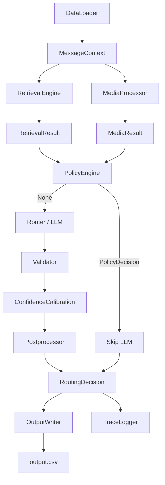

# Architecture

## Architecture Diagram

## Module Details

### 1. Data Loader (`data/loader.py`)

- **Purpose**: Loads all 11 dataset CSVs into pandas DataFrames and assembles a unified `MessageContext` for each incoming message.
- **Inputs**: CSV files from `dataset/` (messages, users, groups, group_members, business_accounts, user_business_history, message_history, message_events, images, voice_notes, daily_notification_summary).
- **Outputs**: `list[MessageContext]` — one per row in messages.csv, with joined metadata from all other tables.
- **Dependencies**: `config.py`, `models/schemas.py`, `utils/helpers.py`.
- **Why it exists**: Provides a single, reliable data pipeline that all later phases build upon. Detects relationships based on actual dataset schema (no invented columns).

### 2. Retrieval Engine (`retrieval/`)

- **Purpose**: Converts large historical context into a compact evidence package for the router.
- **Inputs**: `MessageContext`.
- **Outputs**: `RetrievalResult` containing evidence_message_ids, top_similar_messages, sender_relationship, business_relationship, group_relationship, engagement_summary, trust_score, interest_score, retrieval_summary.
- **Sub-modules**:
  - `analyzers.py`: Sender, business, group, engagement analysis
  - `similarity.py`: RapidFuzz-based similar message retrieval
  - `evidence.py`: Evidence ranking by usefulness (similarity + engagement penalty + recency)
  - `summarizer.py`: Natural-language retrieval summary
- **Dependencies**: `models/schemas.py`, `utils/helpers.py`, `rapidfuzz`.
- **Why it exists**: Reduces hundreds of historical messages to a compact, personalized evidence package so the LLM can reason efficiently.

### 3. Media Intelligence (`media/`)

- **Purpose**: Processes image and voice messages to extract text, entities, urgency, and safety signals.
- **Inputs**: `MessageContext` (media_type, media_id, file paths from images.csv/voice_notes.csv).
- **Outputs**: `MediaResult` with extracted_text, summary, entities (dates/times/money/links/phones), urgency_indicators, safety_indicators, confidence.
- **Sub-modules**:
  - `image_processor.py`: Tesseract OCR with LRU cache
  - `audio_processor.py`: faster-whisper transcription (CPU, int8)
  - `text_analysis.py`: Deterministic regex-based entity/safety/urgency detection
  - `processor.py`: Orchestrator with disk caching (keyed by media_id + file mtime)
- **Dependencies**: `Pillow`, `pytesseract`, `faster-whisper`, `config.py`.
- **Why it exists**: Multimodal messages (images, voice notes) contain critical information that text-only analysis would miss. OCR and ASR make this content available to the router.

### 4. Policy Engine (`policy/`)

- **Purpose**: Evaluates deterministic rules before the LLM. If a rule fires, the LLM is skipped entirely.
- **Inputs**: `MessageContext`, `RetrievalResult`, `MediaResult`.
- **Outputs**: `PolicyDecision | None`.
- **Rules** (priority order):
  1. `scam_detection` (100): Mutes obvious scams (OTP/PIN/phishing + low trust)
  2. `trusted_urgent` (90): Notifies trusted urgent messages (family/admin/verified bank)
  3. `media_failure` (80): Digests messages with failed media extraction
  4. `repetitive_spam` (70): Mutes heavily forwarded messages from ignored senders
- **Why it exists**: Obvious scams and trusted urgent messages don't need LLM reasoning. Deterministic rules are faster, cheaper, and more reliable for clear-cut cases.

### 5. LLM Router (`llm/`)

- **Purpose**: Produces the final routing decision for ambiguous messages (where no policy rule fired).
- **Inputs**: `MessageContext`, `RetrievalResult`, `MediaResult`.
- **Outputs**: `RouterTrace` with prompt_summary, llm_response, validated output, final_decision, calibration_notes, policy_rule, llm_skipped.
- **Sub-modules**:
  - `providers.py`: LLMProvider ABC + OpenAI/Gemini/Ollama/Mock implementations with retry logic
  - `prompt_builder.py`: Structured prompt with Decision Guide, Decision Matrix, Score Explanations, DO NOT rules, Confidence Guide, Few-shot Examples
  - `validator.py`: Strict output validation (action/type/confidence/reason)
  - `confidence.py`: Confidence calibration combining LLM + retrieval + safety + media signals
  - `postprocessor.py`: Attaches evidence IDs from retrieval only (no hallucinated IDs)
- **Why it exists**: Ambiguous messages need contextual reasoning that deterministic rules can't provide. The LLM uses the structured prompt with personalized context to make nuanced decisions.

### 6. Confidence Calibration (`llm/confidence.py`)

- **Purpose**: Combines the LLM's raw confidence with deterministic signals to produce a calibrated score.
- **Inputs**: Raw LLM confidence, `RetrievalResult`, `MediaResult`.
- **Outputs**: Calibrated confidence (0..1) + calibration notes.
- **Signals combined**:
  - Retrieval quality (avg similarity of top evidence, 20% blend)
  - Safety signal strength (boosts mute confidence when trust is low)
  - Media extraction confidence (10% blend)
  - Trust/interest anchors
- **Why it exists**: LLM confidence alone is unreliable. Combining it with deterministic signals produces better-calibrated confidence that correlates with correctness.

### 7. Inference Pipeline (`inference/`)

- **Purpose**: Orchestrates the full production inference flow for all messages.
- **Inputs**: `DataLoader` (provides contexts).
- **Outputs**: `output/output.csv`, per-message traces, statistics report.
- **Sub-modules**:
  - `pipeline.py`: InferencePipeline orchestrator with tqdm progress bar
  - `writer.py`: OutputWriter (exact HackerRank CSV contract)
  - `checkpoint.py`: CheckpointManager (partial_output.csv every 10 messages, resume support)
  - `statistics.py`: PipelineStatistics (latency, success/failure, policy/LLM counts)
  - `trace_logger.py`: TraceLogger (per-message JSON traces)
- **Why it exists**: Production deployment requires checkpointing, error handling, progress tracking, and resume capability. The pipeline orchestrates existing modules without duplicating logic.

### 8. Evaluation Suite (`evaluation/`)

- **Purpose**: Evaluates predictions against ground truth and generates analysis artifacts.
- **Inputs**: `output/output.csv`, ground truth CSV, trace files.
- **Outputs**: metrics.json, confusion matrices, distribution analysis, misclassified.csv, confidence analysis, latency analysis, threshold recommendations, prompt analysis, plots (PNG), markdown + HTML reports.
- **Sub-modules**:
  - `metrics.py`: Accuracy, precision, recall, F1 (macro/weighted/micro)
  - `confusion.py`: Confusion matrix generation
  - `analyzer.py`: Distribution, error, confidence, latency analysis
  - `thresholds.py`: Threshold recommendations (no auto-changes)
  - `report.py`: Markdown + HTML report generation
  - `plots.py`: matplotlib chart generation
  - `evaluator.py`: Orchestrator (read-only)
- **Why it exists**: Systematic evaluation identifies weaknesses, guides prompt improvements, and validates threshold settings. Read-only — never modifies output.csv or the pipeline.

### 9. Models & Utils

- **`models/schemas.py`**: `MessageContext` dataclass — the unified context object passed through the pipeline.
- **`utils/logger.py`**: Centralized logging setup with consistent format.
- **`utils/helpers.py`**: Reusable helpers (is_empty, safe_str, normalize_text, etc.).
- **`config.py`**: Central configuration with environment variable overrides. Loads `.env` via python-dotenv.